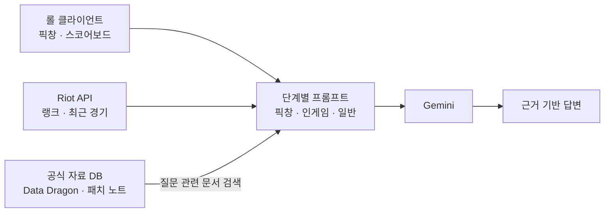

# RiftFlow

**LLM 기반 리그 오브 레전드 AI 코치**

RiftFlow는 롤 클라이언트에서 지금 상황을 읽고, 라이엇 공식 게임 자료를 검색해, LLM(Google Gemini)이 **근거 있는 코칭**을 하도록 만든 데스크톱 프로그램입니다.

일반 챗봇에 롤 질문을 하면 모델은 내 픽창도, 지금 스코어보드도, 이번 패치 수치도 모른 채 기억에 의존해 답합니다. RiftFlow는 질문을 보낼 때 세 가지를 함께 모델에 넣습니다.

- **실시간 게임 상황**: 확정된 픽·밴, 10명의 레벨·KDA·CS·아이템
- **내 기록**: 최근 20경기, 같은 상대를 만났던 결과, 최근 사용한 룬
- **공식 자료**: 질문과 관련된 챔피언·아이템·룬 설명과 패치 노트를 검색(RAG)해 붙인 근거

그리고 게임 단계마다 따로 설계한 프롬프트로, 자료에 없는 수치나 통계를 만들어 내지 않게 합니다.

## 동작 방식



1. **상황 수집**: 2.5초마다 클라이언트 상태를 확인해 픽창인지, 로딩 중인지, 게임 중인지 판별하고 해당 화면으로 자동 전환합니다.
2. **근거 검색**: 질문, 내 챔피언, 상대 챔피언을 검색어로 로컬 공식 자료 DB에서 관련 문서를 찾습니다. 인게임 아이템 추천은 상대 조합에 맞춰 검색어를 보강합니다.
3. **프롬프트 구성**: 게임 단계에 맞는 시스템 프롬프트에 실시간 상황, 개인 기록, 검색된 공식 자료를 JSON으로 묶어 보냅니다.
4. **답변**: Gemini 답변을 화면에 보여 줍니다. 필요한 근거가 없으면 모델을 호출하지 않고 무엇이 부족한지 안내합니다.

## 단계별 AI 코치

### 픽창 코치

챔피언 선택이 시작되면 자동으로 열립니다.

- **모델이 받는 것**: 아군·상대 픽과 밴(확정인지 올려놓기만 했는지 포함), 맞라인 상대, 게임 모드, 이번 픽창에서 채팅으로 말한 요청과 성향, 내 챔피언과 상대의 공식 스킬 설명, 룬 설명, 이 상대를 만났던 내 경기 기록과 최근 룬 페이지
- **이렇게 물어봅니다**: "이 상대를 만났을 때 초반 운영은?", "공격적으로 하고 싶어, 룬 다시 짜줘"
- **성향은 말로 전합니다**: 성향을 고르는 칸은 없습니다. "공격적으로 하고 싶어"처럼 채팅으로 말하면 이후 답변과 룬 추천에 반영하고, '룬'이 들어간 말은 그 요청대로 룬을 바로 다시 추천합니다.
- **지어내지 않는 것**: 상대가 아직 고르는 중인 챔피언, 전체 이용자 상성 승률. 개인 상성은 표본 수와 함께 말하고, 표본이 작으면 단정하지 않습니다.

**룬 추천**: 챔피언을 확정하지 않고 올려놓기만 해도, 잠깐(약 2.5초) 그대로 두면 LLM이 이 픽창에 맞는 룬 페이지 하나를 자동으로 고르고 룬마다 이유를 설명한 뒤 **클라이언트에 바로 적용**합니다. 맞라인 상대가 확정되는 등 조건이 바뀌면 다시 추천하고, 같은 조건은 저장해 둔 결과를 바로 보여 줘서 Gemini를 다시 부르지 않습니다. "룬 추천" 버튼으로 언제든 새로 받을 수 있습니다.

- 모델에는 전체 룬 목록(트리·슬롯별 공식 설명)과 능력치 파편, 내 챔피언·상대 스킬 설명, 상대 조합, 게임 모드, 채팅으로 말한 요청, 이 챔피언으로 최근 쓴 룬 페이지와 승패를 넘깁니다.
- 칼바람 나락에서는 라인이 없다는 점을 반영해 한타·포킹·유지력 기준으로 고릅니다. 아레나처럼 룬을 쓰지 않는 모드에서는 추천하지 않습니다.
- 모델은 정해진 JSON 형식으로 룬 ID만 고릅니다. 핵심 룬 1개, 주 트리 슬롯마다 1개, 보조 트리의 서로 다른 슬롯에서 2개, 파편 줄마다 1개인지는 **코드가 검사**합니다. 규칙을 어기면 틀린 이유를 알려 주고 한 번만 다시 고르게 하며, 그래도 틀리면 추천하지 않습니다.
- 픽창에서는 추천이 나오면 롤 클라이언트에 룬 페이지로 넣고 현재 페이지로 선택합니다. 같은 페이지는 반복해서 적용하지 않습니다.
- 자동 적용에 실패하면(칸이 가득 참 등) 이유를 주황색으로 보여 주고 **클라이언트에 적용** 버튼을 강조합니다. 문제를 해결한 뒤 버튼을 누르면 다시 적용합니다.
- 이름이 `RiftFlow`로 시작하는 페이지 하나만 만들거나 교체하고, 직접 만든 페이지는 지우거나 덮어쓰지 않습니다.

### 인게임 코치

게임이 로딩되면 자동으로 열리고, 끝나면 전적 화면으로 돌아갑니다.

- **모델이 받는 것**: 경과 시간, 10명의 레벨·KDA·분당 CS·아이템·생존 여부, 팀별 추정 골드, 상대 조합(Data Dragon 역할 태그), 후보 아이템의 공식 효과와 가격
- **이렇게 물어봅니다**: "지금 살 아이템 추천"(버튼 한 번), "지금 우리 팀이 불리해?"
- **지어내지 않는 것**: 시야·와드 위치, 상대 소환사 주문 쿨타임, 오브젝트 타이머는 게임이 제공하지 않으므로 관찰한 것처럼 말하지 않습니다. 골드는 보유 아이템 가격 합계라서 항상 '추정'으로 말합니다. 추천은 공식 자료에 있는 아이템만 고르고, 이미 가진 아이템은 빼고 추천합니다.

### AI에게 질문

게임 밖에서 언제든 쓸 수 있는 일반 상담입니다.

- **모델이 받는 것**: 질문, 솔로 랭크, 최근 20경기의 챔피언·승패·KDA·CS·경기 시간, 질문과 관련된 공식 자료
- **이렇게 물어봅니다**: "최근 전적으로 내 장단점 알려줘", "CS 연습은 어떻게 해?", "26.18 패치에서 뭐 바뀌었어?"
- **지어내지 않는 것**: 패치 질문은 해당 버전의 공식 패치 노트가 있을 때만 답합니다. 요약 전적으로 알 수 없는 사망 원인이나 포지셔닝을 본 것처럼 말하지 않습니다.

## 환각을 줄이는 설계

- **근거 우선**: 수치·효과·가격·패치 변경은 검색된 공식 자료에 있는 것만 사실로 말합니다. 모델의 기억과 자료가 다르면 자료를 따릅니다.
- **확인·추정·불가 구분**: 확인되는 값, 추정값(골드), 게임이 제공하지 않는 값(시야, 쿨타임)을 프롬프트에서 나눠 다룹니다.
- **통계를 만들지 않음**: DB에 전체 이용자 승률·픽률·상성 통계가 없으므로 이를 지어내지 않습니다. 개인 기록은 표본 수와 함께 '내 기록'으로만 말합니다.
- **근거가 없으면 호출하지 않음**: 아이템 자료 없이 아이템 추천을 요청하거나 없는 패치 버전을 물으면 모델을 부르지 않고 안내합니다.
- **입력은 데이터로만**: 게임 데이터나 문서 안에 섞인 지시문은 따르지 않도록 프롬프트에 명시했습니다.
- **버전 보존**: 패치 노트 번호(예: `26.18`)와 게임 데이터 버전(예: `16.18.1`)을 섞어 쓰지 않습니다.
- **개인정보 최소화**: 소환사 이름, 계정 ID, 경기 ID는 모델에 보내지 않습니다. AI 대화는 저장하지 않습니다.

## 그 밖의 화면

- **전적**: 롤 클라이언트 로그인을 자동 인식해 랭크와 최근 20경기(챔피언, 날짜, KDA, CS, Damage, Gold)를 보여 줍니다. 경기를 클릭하면 10명 비교와 전투·피해량·시야·골드·오브젝트 상세 통계를 볼 수 있습니다.
- **설정 및 데이터**: Data Dragon의 챔피언·아이템·룬 정보와 최근 한국어 패치 노트를 내려받아 AI가 참고할 자료를 최신으로 유지합니다. 처음에는 API 키 없이 둘러볼 수 있는 예시 자료로 동작합니다.

## 설치

Python 3.11 이상이 필요하며 Windows를 대상으로 합니다. 모든 명령은 저장소 루트(`RiftFlow` 폴더)에서 실행합니다.

### pip으로 설치

```bash
python -m venv .venv
```

Windows PowerShell:

```powershell
.venv\Scripts\Activate.ps1
```

macOS / Linux:

```bash
source .venv/bin/activate
```

```bash
python -m pip install -e .
```

### uv로 설치

[uv](https://docs.astral.sh/uv/)로 만든 가상환경에는 pip이 들어 있지 않습니다. `No module named pip` 오류가 나면 이 방법을 씁니다.

```bash
uv venv
uv pip install -e .
```

이미 `.venv`가 있다면 `uv pip install --python .venv\Scripts\python.exe -e .`처럼 설치할 가상환경을 직접 지정할 수 있습니다.

## 실행

가상환경을 켰다면:

```bash
python -m ui
```

가상환경을 켜지 않고 바로 실행하려면 (Windows):

```bash
.venv\Scripts\python.exe -m ui
```

설치 후에는 `riftflow` 명령(`.venv\Scripts\riftflow.exe`)으로도 실행할 수 있습니다. 데이터 폴더를 현재 위치 기준으로 만들기 때문에 저장소 루트에서 실행하세요.
`No module named ui` 오류가 나면 위 설치 단계를 먼저 실행하세요.

AI가 최신 자료를 근거로 답하게 하려면 **설정 및 데이터 → 공식 게임 자료 수집 / 업데이트**를 한 번 눌러 공식 자료를 내려받습니다.

## 환경변수

`.env.example`을 `.env`로 복사한 뒤 값을 채웁니다. `.env`는 Git에 올라가지 않습니다.

| 이름 | 설명 |
|---|---|
| `GEMINI_API_KEY` | **AI 코칭에 필요합니다.** Google AI Studio에서 발급합니다. |
| `GEMINI_MODEL` | 사용할 Gemini 모델입니다. 기본값은 `gemini-3.5-flash-lite`입니다. |
| `RIOT_API_KEY` | 로그인 계정 인식, 랭크와 전적 조회에 사용합니다. [Riot Developer Portal](https://developer.riotgames.com/)에서 발급합니다. |
| `RIOT_PLATFORM` | 선택. 플랫폼 라우팅, 기본값 `kr` |
| `RIOT_REGION` | 선택. 대륙 라우팅, 기본값 `asia` |

픽창과 인게임 정보는 로컬 롤 클라이언트에서 직접 읽으므로 Riot API 키가 필요하지 않습니다.
Gemini는 질문을 보낼 때만 한 번 호출하며(재시도 없음, 약 60초 제한), 사용할 모델은 설정 화면에서도 바꿀 수 있습니다.

## 명령줄 도구

```bash
python -m ui.ask "무한의 대검 가격과 조합 재료를 알려줘"
python -m ui.ask --local "무한의 대검 가격과 조합 재료를 알려줘"
python -m knowledge update
python -m knowledge status
```

`ui.ask`는 공식 자료를 검색한 뒤 Gemini에 답변을 요청합니다. `--local`은 모델을 호출하지 않고 검색된 근거만 보여 주므로 검색 품질을 확인할 때 씁니다. `knowledge update`는 공식 자료를 내려받고, `status`는 저장된 자료를 확인합니다.

## 개발

### 프롬프트 수정

게임 단계마다 프롬프트가 분리돼 있어 코드 흐름을 건드리지 않고 코칭 방식을 바꿀 수 있습니다.

| 파일 | 역할 |
|---|---|
| `src/game_phases/before_game/prompt.py` | 픽창 코치 |
| `src/game_phases/before_game/runes.py` | 룬 추천 (`RUNE_SYSTEM`) |
| `src/game_phases/in_game/prompt.py` | 인게임 코치 |
| `src/game_phases/after_game/prompt.py` | 경기 후 분석 (터미널 개발용) |
| `src/game_phases/out_game/prompt.py` | 메타·패치 질문 (터미널 개발용) |
| `src/ui/services.py` | AI에게 질문 화면의 일반 상담 |

단계별 프롬프트는 실제 게임 없이 터미널에서 확인할 수 있습니다.

```bash
python test.py
```

### 테스트

```bash
python -m unittest discover -s tests/integration -v
```

패키지를 설치하지 않았다면 앞에 `PYTHONPATH=src`를 붙여 실행합니다. 테스트는 모두 오프라인으로 동작하며, 모델 호출은 가짜 응답으로 바꿔 프롬프트에 들어가는 내용(근거, 표본 수, 식별자 비노출 등)을 검증합니다.

### 데이터

- `data/demo.db`: 예시 자료. 앱을 실행하면 자동으로 준비됩니다.
- `data/riftflow.db`: 내려받은 공식 게임 자료. AI 답변의 근거가 됩니다.
- `data/personal_matches.db`: 로그인 계정의 최근 경기에서 뽑은 맞라인 상대·룬 기록

데이터 파일과 키는 Git에 올라가지 않습니다.

### 관련 문서

- `docs/architecture.md`: 전체 구조
- `docs/interfaces.md`: 모듈 간 데이터 형식
- `docs/game-phases.md`: 게임 단계별 폴더, 프롬프트 수정 위치, 화면 자동 전환
- `docs/riot-application.md`: 라이엇 API 키 신청 안내
- `docs/ui/README.md`: 화면 설계 자료

## 고지

RiftFlow isn't endorsed by Riot Games and doesn't reflect the views or opinions of Riot Games or anyone officially involved in producing or managing Riot Games properties. Riot Games, and all associated properties are trademarks or registered trademarks of Riot Games, Inc.
