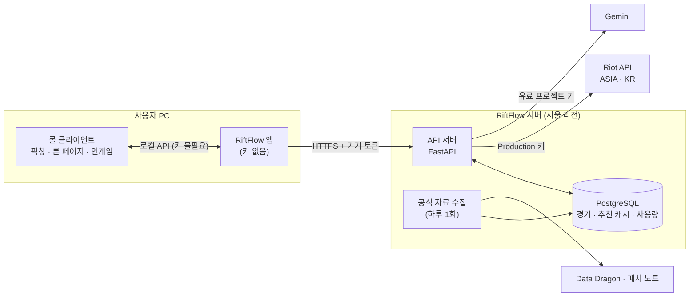

# RiftFlow 서버 구조 설계

작성일: 2026-09-27. 상태: **1단계(라이엇 데이터)와 2단계(AI 4개 경로, 룬 추천 공유 캐시, 기기별 AI 한도) 구현.** 3단계 이후는 설계안.

지금은 미니 PC 한 대에 **systemd + SQLite + Caddy(HTTPS) + DuckDNS**로 배포합니다 (`docs/server-deploy.md`).
아래의 PostgreSQL·컨테이너 구성은 클라우드로 옮길 때의 목표입니다. DB 코드는 `src/server/db.py` 한 곳에 모아 두었습니다.

## 왜 서버가 필요한가

라이엇 정책은 배포하는 프로그램에 API 키를 넣지 못하게 합니다("Do not include your API key in your code, especially if you plan on distributing a binary").
Gemini 키도 프로그램에 넣으면 누구나 꺼내 쓸 수 있습니다. 그래서 **키는 서버에만 두고, 앱은 우리 서버하고만 통신**합니다.

서버가 하는 일은 세 가지입니다.

1. 라이엇 API를 대신 호출하고 결과를 저장해 재사용한다 (한도 절약).
2. AI 요청을 대신 처리한다. 프롬프트와 근거 자료는 서버가 만들고 Gemini를 부른다.
3. 기기별 사용량을 제한해 키 남용과 비용 폭주를 막는다.

## 전체 구조



**앱에 그대로 남는 것**: 픽창 인식, 룬 페이지 적용, 인게임 스코어보드 (롤 클라이언트 로컬 API라 키가 필요 없음), 화면 표시용 챔피언·아이템 이름과 아이콘.
**서버로 옮기는 것**: 라이엇 서버 API 호출(`src/riot/service.py`), Gemini 호출(`src/rag/gemini.py`)과 프롬프트 조립.

## 기술 선택

| 항목 | 선택 | 이유 |
|---|---|---|
| 언어·프레임워크 | Python 3.11+, FastAPI, Uvicorn | 지금 코드(`contracts`, `riot`, `knowledge`, `rag`, `game_phases`)를 그대로 import해서 쓴다 |
| DB | PostgreSQL (관리형) | 경기 데이터 영구 저장, 서버를 여러 대로 늘려도 같은 DB 사용 |
| 배포 | Docker 컨테이너 1대로 시작, 서울 리전 | 한국 사용자와 라이엇 ASIA 라우팅에 가깝다. 처음엔 한 대로 충분 |
| 비밀값 | 호스팅 서비스의 비밀값 저장소(환경변수) | 저장소·이미지에 키를 남기지 않는다 |
| 코드 위치 | `src/server/` | 같은 저장소에서 기존 패키지를 import. 서버 전용 의존성은 `pyproject.toml`의 `[server]` 추가 설치 항목으로 분리 |

호스팅 업체(Cloud Run, Fly.io, 일반 VPS 등)는 정해야 합니다. 요구 조건은 컨테이너 실행, 서울 리전, 관리형 PostgreSQL 연결, HTTPS입니다.

## API 설계

모든 경로는 `/v1` 아래에 둡니다. 앱은 `Authorization: Bearer <기기 토큰>`과 `X-RiftFlow-Version: <앱 버전>` 헤더를 보냅니다.
오류는 `{"error": {"code": "...", "message": "사용자에게 보여 줄 한국어 문장"}}` 형식으로 통일하고, 한도 초과에는 `429`와 `Retry-After`를 줍니다.

### 기기 등록

| 경로 | 설명 |
|---|---|
| `POST /v1/devices` | 첫 실행 때 한 번 호출. 무작위 기기 토큰을 발급한다. 서버에는 토큰의 해시만 저장 |

로그인 없이 시작합니다. 기기 토큰은 사용량 제한의 단위일 뿐 개인을 식별하지 않습니다.
나중에 계정 인증이 필요하면 Production 승인 뒤 Riot Sign On(RSO)을 붙입니다.

### 라이엇 데이터

| 경로 | 앱의 기존 함수 | 응답 | 서버 캐시 |
|---|---|---|---|
| `GET /v1/riot/account/{gameName}/{tagLine}` | `get_player` | `PlayerIdentity` (puuid, riot_id, 레벨, 아이콘) | 1일 |
| `GET /v1/riot/rank/{puuid}` | `get_solo_rank` | `RankInfo` 또는 `null` | 5분 |
| `GET /v1/riot/matches/{puuid}?count=20` | `get_recent_matches_with_details` | `MatchSummary` 목록 + 경기별 요약 관찰값 | 경기 ID 목록 1분, 경기 상세 영구 |
| `GET /v1/riot/matches/detail/{matchId}` | `get_match_detail` | 경기 상세 원본 (상세 통계 창용) | 영구 |

- **경기 상세는 바뀌지 않으므로 한 번 받으면 영구 저장**합니다. 새로고침 때는 새 경기 ID만 라이엇에 요청합니다.
- `matches` 응답에는 경기 상세 20개 원본 대신, 앱의 개인 상성 기록(`save_recent_matchups`)에 필요한 요약(챔피언, 맞라인 상대, 라인, 승패, KDA, 룬 페이지)을 함께 담습니다. 전송량이 줄고 개인 상성 계산 규칙이 서버와 앱에서 달라지지 않습니다.
- 경기 상세 원본은 사용자가 경기를 눌렀을 때만 `detail`로 받습니다.

### AI

서버는 **정해진 기능별 요청만** 받습니다. 앱이 보낸 임의의 프롬프트를 Gemini로 넘기는 범용 경로는 만들지 않습니다. 그런 경로가 있으면 우리 키가 누구나 쓰는 무료 Gemini 창구가 됩니다.
시스템 프롬프트, 공식 자료 검색, 룬 규칙 검사는 모두 서버에서 합니다. 앱은 상황 데이터만 보냅니다.

| 경로 | 지금 코드 | 앱이 보내는 것 |
|---|---|---|
| `POST /v1/runes/recommend` | `game_phases.before_game.runes.recommend_runes` | 챔피언·상대·아군·상대 조합(Data Dragon ID), 포지션, 게임 모드, 채팅 요청, 최근 룬 페이지 |
| `POST /v1/coach/pick` | `game_phases.before_game.desktop.answer_before_game` | 질문, 픽창 요약, 개인 상성 관찰값, 앞선 채팅 |
| `POST /v1/coach/in-game` | `game_phases.in_game.desktop.answer_in_game` | 질문, 스코어보드 요약(소환사명 제외) |
| `POST /v1/coach/general` | `ui.services.ask_general` | 질문, 랭크·최근 전적 요약(식별자 제외) |

`POST /v1/runes/recommend` 예시:

```json
{
  "champion": "Leblanc",
  "opponent": "Zed",
  "position": "middle",
  "game_mode": "CLASSIC",
  "allies": ["Garen"],
  "enemies": ["Zed", "Malphite"],
  "user_requests": [],
  "recent_pages": [{"won": false, "opponent": "Lux", "page": [{"style": 8100, "perks": [8112]}]}]
}
```

응답은 지금 `recommend_runes`의 반환값(`page`, `summary`, `reasons`, `version`)에 `cached` 여부를 더한 형태입니다.

**룬 추천 공유 캐시**: 같은 패치 버전·챔피언·상대·포지션·게임 모드의 추천은 사용자끼리 공유합니다. 픽창 자동 추천이 가장 자주 불리므로 호출이 크게 줄어듭니다.
공유하려면 개인 정보가 섞이면 안 되므로, 이렇게 나누는 것을 제안합니다.

- 자동 추천(채팅 요청 없음): 최근 룬 페이지를 빼고 추천하고 공유 캐시에 저장
- 채팅 요청이 있는 추천: 개인 기록과 요청을 넣어 새로 만들고, 캐시에 넣지 않음

### 공식 자료 (3단계)

| 경로 | 설명 |
|---|---|
| `GET /v1/knowledge/manifest` | 최신 자료 버전, 파일 크기, SHA-256 |
| `GET /v1/knowledge/snapshot` | 서버가 하루 한 번 만든 공식 자료 DB 파일 |

지금은 앱마다 Data Dragon과 라이엇 패치 노트 페이지를 직접 수집합니다. 서버가 하루 한 번 수집해 파일로 나눠 주면 사용자마다 같은 자료를 쓰고, 공식 사이트에 요청이 몰리지 않습니다.

## DB 테이블

| 테이블 | 주요 열 | 용도 |
|---|---|---|
| `devices` | id, token_hash, created_at, last_seen_at, app_version | 기기 토큰 확인 |
| `usage_daily` | device_id, day, riot_requests, ai_requests | 기기별 하루 사용량 제한 |
| `riot_accounts` | puuid, game_name, tag_line, summoner_level, profile_icon_id, fetched_at | 계정 캐시 |
| `league_entries` | puuid, entry(JSON), fetched_at | 랭크 캐시 |
| `player_matches` | puuid, match_id, played_at | 플레이어별 경기 ID 목록 |
| `matches` | match_id, game_start, queue_id, game_mode, detail(JSON), fetched_at | 경기 상세 영구 저장 |
| `match_participants` | match_id, puuid, champion, team_position, win, kills, deaths, assists, rune_page(JSON) | 빠른 요약 조회. 나중에 자체 통계 집계의 바탕 |
| `rune_recommendations` | cache_key, version, result(JSON), created_at | 룬 추천 공유 캐시 |

`match_participants`는 당장은 요약 응답을 빠르게 만드는 용도입니다. 경기가 쌓이면 op.gg처럼 **자체 챔피언 승률·룬 통계**를 집계하는 바탕이 됩니다. 지금 프롬프트가 "통계가 없다"고 밝히는 부분을 나중에 채울 수 있습니다.

## 라이엇 호출량 관리

- **라우팅별 요청 제한기**: ASIA(계정·경기)와 KR(소환사·랭크) 한도를 따로 관리합니다. 라이엇 응답 헤더(`X-App-Rate-Limit-Count` 등)와 `Retry-After`를 따르고, 한도에 가까우면 요청을 줄 세웁니다. 처음엔 서버 한 대라 프로그램 안에서 관리하고, 여러 대로 늘리면 DB나 Redis로 공유합니다.
- **호출량 비교** (전적 20경기 기준)

| 상황 | 지금 (앱 직접 호출) | 서버 캐시 적용 |
|---|---|---|
| 처음 불러오기 | 24회 | 24회 |
| 게임 한 판 뒤 새로고침 | 24회 | 약 3회 (경기 ID 목록 1 + 새 경기 1 + 랭크 1) |
| 다른 사용자가 이미 받은 경기 | 매번 다시 받음 | 0회 |

Production 키 한도(ASIA 10초 500회)에서 캐시를 쓰면 게임 뒤 새로고침을 10초에 150건 이상 처리할 수 있습니다.

## Gemini 비용·한도 관리

- 결제를 연결한 **서버 전용 프로젝트**의 키를 씁니다. 한도는 프로젝트 단위로 매겨집니다.
- 기기별 하루 AI 요청 수를 제한합니다. 시작값을 예를 들면 하루 30회이고, 설정으로 조절합니다.
- 룬 추천 공유 캐시로 가장 잦은 호출을 줄입니다.
- 요청마다 입력·출력 토큰 수를 기록하고, Google Cloud 결제 예산 알림을 설정합니다.
- 서버는 대화 내용을 저장하지 않습니다. 대화 기록은 각 사용자 PC(`chat_history.db`)에만 있고, 앱이 질문마다 최근 대화(최대 8개, 한 개 1,200자)를 함께 보냅니다. 기록하는 것은 시각, 기능 이름, 토큰 수, 성공 여부뿐입니다.

## 보안·개인정보

- 모든 통신은 HTTPS. 라이엇·Gemini 키와 DB 접속 정보는 서버 비밀값으로만 둔다.
- 요청 본문 크기 제한(예: 32KB), 채팅 한 줄 1,000자 제한(지금 앱과 같음), 챔피언 ID는 서버의 Data Dragon 목록으로 검증.
- 서버 로그에 채팅 내용, Riot ID, PUUID를 남기지 않는다. 기기는 토큰 해시로만 구분.
- 기기와 조회한 계정을 연결해 저장하지 않는다.
- 저장하는 개인 관련 데이터는 공개 경기 기록(경기·참가자)과 계정 캐시다. 보관 기간과 삭제 요청 처리 방법을 개인정보처리방침에 적는다.

## 앱 쪽 변경

| 파일 | 변경 |
|---|---|
| `src/api/client.py` (새 파일) | 서버 주소, 기기 토큰 발급·보관, 요청·재시도(`Retry-After` 준수), 오류 문장 변환 |
| `src/riot/service.py` | 서버 모드면 라이엇 대신 서버 API 호출. 반환 형식(`PlayerIdentity`, `MatchSummary`, `RankInfo`)은 그대로 유지 |
| `src/ui/__main__.py` | `riot_profile`이 경기 상세 원본 대신 서버의 요약 관찰값으로 개인 기록 저장. 룬 추천·코치 질문은 서버 호출로 교체 |
| `src/game_phases/*`, `src/rag/*` | 서버에서 재사용. 앱에서는 개발 모드(직접 호출)에만 사용 |
| `.env` | 배포판에는 키를 넣지 않음. `RIFTFLOW_SERVER_URL`만 둔다 |

개발 편의를 위해 **직접 모드**는 남겨 둡니다. `RIFTFLOW_SERVER_URL`이 없고 `.env`에 키가 있으면 지금처럼 앱이 직접 호출합니다. 지금 있는 테스트 206개도 그대로 쓸 수 있습니다.

## 진행 단계

| 단계 | 내용 | 끝나면 |
|---|---|---|
| 1 | 서버 뼈대, 기기 토큰, 라이엇 API 대신 호출 + 경기 캐시 + 요청 제한기, 앱 서버 모드 | 앱에서 라이엇 키 제거 가능 |
| 2 | AI 경로 4개를 서버로 이전, 룬 추천 공유 캐시, 기기별 AI 사용량 제한 | 앱에서 Gemini 키 제거, 배포판에 키 없음 |
| 3 | 공식 자료 스냅샷 배포, 사용량·오류 모니터링, 개인정보처리방침 | 라이엇 Production 신청 가능 |
| 4 | Production 키 전환, 소수 공개 베타 | 공개 서비스 |
| 이후 | RSO 로그인, 쌓인 경기로 자체 승률·룬 통계 집계 | op.gg형 통계 기능 |

1단계까지 가면 `docs/riot-production-application.md`의 제출 전 해결 항목 1번(키 보관)과 4번(429 처리)이 해결됩니다.

## 정해야 할 것

1. 호스팅 업체와 관리형 PostgreSQL 업체
2. 자동 룬 추천에서 개인 룬 기록을 빼고 공유 캐시를 쓸지 (위 제안)
3. 기기별 하루 사용량 시작값 (라이엇 새로고침 횟수, AI 요청 수)
4. 서버 운영 비용을 누가 어떤 계정으로 낼지 (Gemini 결제 계정, 호스팅)
